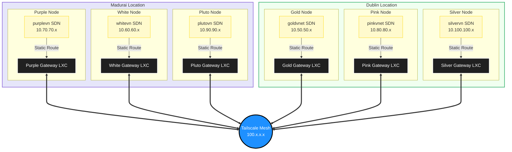

# Proxmox Node Locations

This document serves as a persistent reference for the physical locations of the PiltiSmart infrastructure nodes.

| Node Name | Location | SDN VNet | Subnet Range | Gateway VMID | Gateway SDN IP | Gateway Tailscale IP |
| :--- | :--- | :--- | :--- | :--- | :--- | :--- |
| **Purple** | Madurai | `purplevn` | `10.70.70.0/24` | 999 | `10.70.70.3` | `100.118.179.53` |
| **White** | Madurai | `whitevn` | `10.60.60.0/24` | 999 | `10.60.60.4` | `100.68.97.57` |
| **Pluto** | Madurai | `plutovn` | `10.90.90.0/24` | 999 | `10.90.90.3` | `100.98.57.63` |
| **Pink** | Dublin | `pinkvnet` | `10.80.80.0/24` | 399 | `10.80.80.2` | `100.118.72.62` |
| **Gold** | Dublin | `goldvnet` | `10.50.50.0/24` | 999 | `10.50.50.3` | `100.88.139.76` |
| **Silver** | Dublin | `silvervn` | `10.100.100.0/24` | 499 | `10.100.100.2` | `100.72.150.29` |

## Site-to-Site VPN Topology

The following diagram illustrates how the individual Proxmox SDN networks route their internal traffic out to their local Gateway LXCs, which then bridge securely across the Internet via the Tailscale Mesh.

