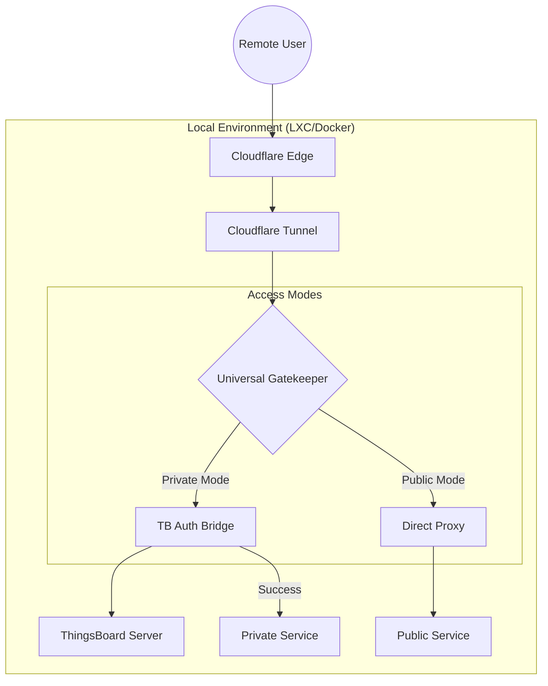
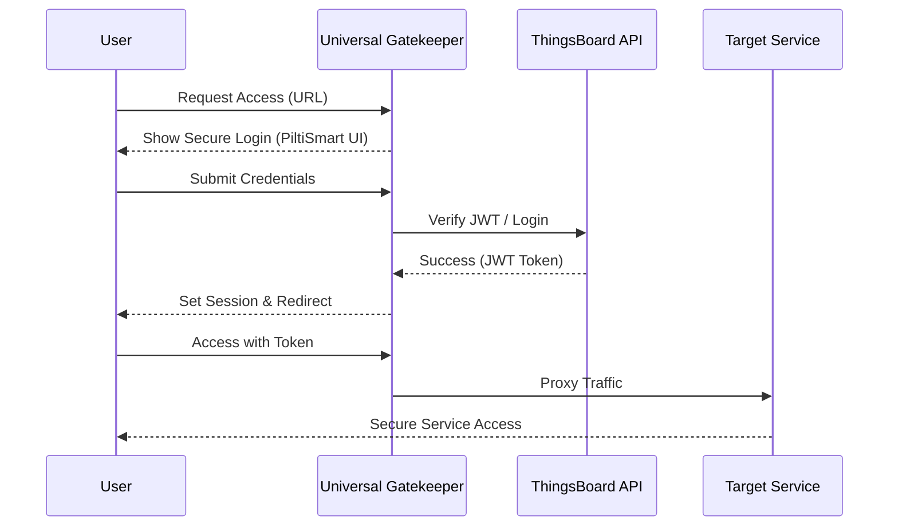

# PiltiSmart Cloudflare Bridge

### Enterprise-Grade Secure Remote Access & Service Gatekeeper


PiltiSmart Cloudflare Bridge is a high-performance, zero-trust remote access solution designed to bridge local services (SSH, Web, APIs) to the cloud securely. By leveraging **Cloudflare Tunnels** and **ThingsBoard JWT Authentication**, it provides a unified "Universal Gatekeeper" that can protect any port with enterprise-level security.

---

## 🏗️ Architecture & Flow

The system operates as a smart proxy layer between the public internet and your private infrastructure.

### 1. High-Level Architecture


### 2. Authentication Flow (Private Mode)


---

## 🚀 Key Features

*   **🛡️ Universal Gatekeeper**: Granular control over which services require ThingsBoard authentication (`private`) and which are open (`public`).
*   **🔗 Zero-Config Networking**: Bypasses firewalls and NAT using Cloudflare Quick Tunnels. No port forwarding required.
*   **📊 Rich Metadata Integration**: Real-time reporting of service health and URLs directly to Proxmox Notes in structured JSON.
*   **⚡ Dynamic Multi-Port Scaling**: Manage multiple services (SSH, HTTP, MQTT, etc.) from a single `docker-compose` configuration.
*   **🎨 Premium UI**: Optimized, branded login experience with real-time validation and error handling.

---

## 🛠️ Installation & Setup

### 1. Host Monitoring (Proxmox)
Deploy the polling script on your Proxmox host to automatically sync URLs to the VM Notes.

```bash
cat << 'EOF' > /usr/local/bin/update-bridge-notes.sh
#!/bin/bash
# Enterprise Sync Script for PiltiSmart Bridge
export PATH=/usr/local/sbin:/usr/local/bin:/usr/sbin:/usr/bin:/sbin:/bin
PCT=/usr/sbin/pct
RUNNING_VMS=$($PCT list | awk 'NR>1 && $2=="running" {print $1}')
for VMID in $RUNNING_VMS; do
    URL=$($PCT exec $VMID -- cat /app/tmp/tunnel_url 2>/dev/null)
    if [ -n "$URL" ]; then
        $PCT set $VMID --description "$URL"
    fi
done
EOF
chmod +x /usr/local/bin/update-bridge-notes.sh
```

### 2. Container Deployment (`docker-compose.yml`)
Configure your services using the `EXT_PORT:MODE:INT_PORT` schema.

```yaml
services:
  gatekeeper:
    image: piltismartsolutions/tb-ssh-bridge:latest
    environment:
      - TB_SERVER=https://tb.piltismart.com
      - SSH_HOST=172.17.0.1
      # Configuration Schema: EXTERNAL_PORT:ACCESS_MODE:INTERNAL_TARGET
      - EXPOSE_PORTS=3000:private:7681, 80:public:80, 8080:private:8080
    volumes:
      - ./tmp:/tmp
    restart: always
```

---

## 📑 Service Reporting
The system generates structured JSON metadata for enterprise monitoring:

```json
{
  "last_updated": "2026-04-27T13:46:17Z",
  "services": {
    "3000": {
      "url": "https://village-leadership-variable-photos.trycloudflare.com",
      "access": "private",
      "target": "7681"
    },
    "80": {
      "url": "https://installations-dear-cap-chance.trycloudflare.com",
      "access": "public",
      "target": "80"
    }
  }
}
```

---

## 🛡️ Security Best Practices
1.  **JWT Verification**: All `private` traffic is intercepted by the PiltiSmart Auth Bridge which validates tokens against the ThingsBoard API.
2.  **Environment Isolation**: Target services are accessed via the internal Docker gateway (`172.17.0.1`), keeping them shielded from direct public exposure.
3.  **TLS Encryption**: All tunnels utilize Cloudflare's global edge network for end-to-end encryption.

---

## 💾 Secure Database Access (TCP)

The PiltiSmart Bridge also supports database protocols (PostgreSQL, MySQL, Redis). Because databases use **TCP**, they require a local client bridge.

### 1. Server Configuration
Map a hostname (e.g., `db-purple.piltismart.com`) to your database port (e.g., `5432`) in the Cloudflare Dashboard as a **TCP** service.

### 2. Client Connection (Your Laptop)
Since you cannot open a database in a browser, run this command on your machine to create a local secure tunnel:
```bash
cloudflared access tcp --hostname db-purple.piltismart.com --url localhost:5432
```
Now, point your database tool (DBeaver, PGAdmin) to `localhost:5432`.

---

## 📞 Support
For enterprise support and custom integrations, please visit [PiltiSmart Solutions](https://piltismart.com).

&copy; 2026 PiltiSmart Solutions. All rights reserved.
