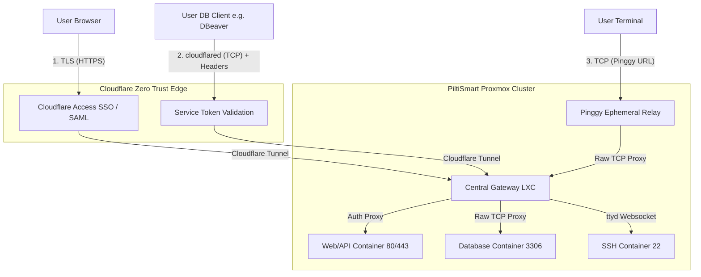

# PiltiSmart Cloudflare Bridge

### The Enterprise Ingress Controller & Universal Gatekeeper


PiltiSmart Cloudflare Bridge is a high-performance, Zero-Trust remote access solution designed to bridge local Proxmox services (SSH, Web, APIs, and Databases) to the cloud securely. 

By leveraging **Cloudflare Tunnels**, **ThingsBoard JWT Authentication**, and **Just-In-Time Service Tokens**, it acts as a central **Ingress Controller** for your entire Proxmox cluster, completely eliminating the need for open firewall ports or local VPN clients.

---

## 🏗️ Enterprise-Level Zero Trust Architecture

Unlike traditional VPNs that grant broad network access, PiltiSmart Bridge connects *users directly to specific applications* via three distinct, highly secure data flows.

### Architecture Flow



### Why this architecture is superior:
1. **Zero Open Ports**: The Gateway establishes outbound-only connections to the Cloudflare Edge. Your Proxmox firewall remains completely locked down.
2. **Protocol-Specific Isolation**: 
   - **Web Traffic** is intercepted by Cloudflare Access for ThingsBoard SSO validation.
   - **Database Traffic (Secure TCP)** bypasses browser redirects, utilizing cryptographically secure Machine-to-Machine Service Tokens that expire automatically.
   - **SSH Traffic (Pinggy)** is brokered via ephemeral 1-hour public TCP endpoints, ensuring long-standing backdoors cannot exist.
3. **Single Tunnel Dependency**: Using exactly one Cloudflare Tunnel (`TUNNEL_TOKEN`) for the entire cluster eliminates load-balancing conflicts and "Tunnel Degraded" errors.

---

## 🚀 Key Features

*   **🛡️ Universal Gatekeeper**: Granular control over which services require authentication (`private`) and which are open (`public`).
*   **🔑 JIT Secure TCP**: Just-In-Time provisioning of Cloudflare Service Tokens for seamless, CLI-based database connections.
*   **⚡ Webhook Auto-Discovery**: Dynamically register new LXCs without editing YAML or restarting the tunnel.
*   **🌐 DNS Automation**: Uses the Cloudflare API to automatically generate and map subdomains (e.g., `stcp3306-purple.piltismart.com`).
*   **🩺 Real-Time Health Checks**: Continuously pings registered LXCs to ensure services are online.

---

## 🖥️ User Guide: The Web UI

The Gateway provides a sleek, responsive Dashboard available at your configured Gateway Domain (e.g., `admin-gold.piltismart.com`).

### Registering a Route (Strict Auto-Selection)
The UI features intelligent, strict dependency logic to prevent misconfiguration:
1. Enter the Target LXC VMID and internal IP address.
2. **Select a Port Preset**:
   - Choosing **SSH (22)** auto-locks the configuration to **Type: TCP** and **Access Type: TCP (Raw)**.
   - Choosing **MySQL (3306)** auto-locks to **Type: TCP** and **Access Type: Secure TCP**.
   - Choosing **HTTP (80)** auto-locks to **Type: TLS**, leaving you the choice between `Public` and `Private` Access Types.

### Connecting to Secure TCP (Databases)
When you register a `Secure TCP` route, the Gateway dynamically generates a temporary Cloudflare Service Token. 
1. A secure modal will appear displaying your **Client ID** and **Client Secret**.
2. Run the provided command on your local machine to establish the secure tunnel:
   ```bash
   cloudflared access tcp --hostname stcp3306-purple.piltismart.com --url 127.0.0.1:3306 --service-token-id "<ID>" --service-token-secret "<SECRET>"
   ```
3. Open DBeaver or MySQL Workbench and connect to `127.0.0.1:3306`.
*(Note: If using MySQL 8+, ensure `allowPublicKeyRetrieval=true` in your driver settings).*

---

## 📑 User Guide: The REST API

The Gateway exposes a complete REST API to automate your infrastructure. View the interactive Swagger documentation by navigating to `http://<GATEWAY_IP>:5000/docs`.

### Auto-Register New LXCs (The Webhook)
When your provisioning script finishes creating a new LXC, send a JSON payload to the Gateway to automatically provision DNS, Cloudflare rules, and security tokens.

```bash
curl -X POST http://<GATEWAY_IP>:5000/register \
  -H "Content-Type: application/json" \
  -H "x-api-key: your_api_key" \
  -d '{
    "vmid": 105,
    "envType": "production",
    "hostname": "purple",
    "ip": "192.168.0.105",
    "force": true,
    "expose": [
      {
        "port": 3306, 
        "mode": "secure_tcp",
        "validityDays": 30
      },
      {
        "port": 22, 
        "mode": "tcp",
        "idleTimeout": 60
      },
      {
        "port": 80, 
        "mode": "public"
      }
    ]
  }'
```

#### Payload Mode Definitions:
*   `secure_tcp`: provisions a Machine-to-Machine Service Token. Requires `validityDays` (Max 90).
*   `tcp`: provisions a Pinggy raw TCP URL. Requires `idleTimeout` in minutes (0 for infinite).
*   `public` / `private`: provisions standard Cloudflare HTTP/S proxying.

### List All Services
Retrieve the current state, Cloudflare URLs, and **Health Status** of all registered LXCs:
```bash
curl -X GET http://<GATEWAY_IP>:5000/services -H "x-api-key: your_api_key"
```

---

## 🛠️ Installation & Setup

Deploy ONE Gateway container per Proxmox cluster using `docker-compose.yml`:

```yaml
services:
  tb-ssh-bridge:
    image: piltismartsolutions/tb-ssh-bridge:latest
    container_name: piltismart-gateway
    network_mode: host
    environment:
      - TB_SERVER=https://tb.piltismart.com
      - TUNNEL_TOKEN=your_cloudflared_tunnel_token
      - CF_API_TOKEN=your_cloudflare_api_token
      - CF_ACCOUNT_ID=your_cloudflare_account_id
      - CF_ZONE_ID=your_cloudflare_zone_id
      - BASE_DOMAIN=piltismart.com
      - ADMIN_PORT=5000
      - PROXY_PORT=8080
      - API_KEY=your_secure_backend_api_key
    restart: always
```

---

## 📞 Support
For enterprise support and custom integrations, please visit [PiltiSmart Solutions](https://piltismart.com).

&copy; 2026 PiltiSmart Solutions. All rights reserved.
