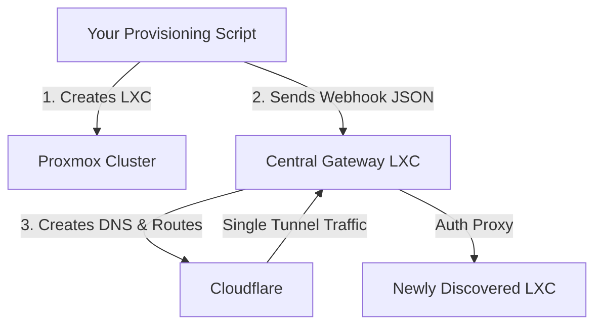

# PiltiSmart Cloudflare Bridge

### The Proxmox Ingress Controller & Universal Gatekeeper


PiltiSmart Cloudflare Bridge is a high-performance, zero-trust remote access solution designed to bridge local Proxmox services (SSH, Web, APIs) to the cloud securely. 

By leveraging **Cloudflare Tunnels** and **ThingsBoard JWT Authentication**, it acts as a central **Ingress Controller** for your entire Proxmox cluster.

---

## 🏗️ The "Zero-Touch" Architecture

The system operates as a single, central Gateway on your Proxmox cluster. When you provision new LXC containers, they automatically register themselves with the Gateway via a Webhook. The Gateway dynamically updates Cloudflare DNS, Tunnel routing, and secures the ports!

### Architecture Flow


---

## 🚀 Key Features

*   **🛡️ Universal Gatekeeper**: Granular control over which services require ThingsBoard authentication (`private`) and which are open (`public`).
*   **🔗 Single Tunnel Architecture**: Uses exactly one Cloudflare Tunnel (`TUNNEL_TOKEN`) for the entire cluster to avoid load-balancing issues.
*   **⚡ Webhook Auto-Discovery**: Dynamically register new LXCs without editing YAML or restarting the tunnel.
*   **🌐 DNS Automation**: Uses the Cloudflare API to automatically generate and map subdomains (e.g., `105-purple.piltismart.com`).
*   **🩺 Real-Time Health Checks**: Continuously pings registered LXCs to ensure services are online.
*   **📖 Swagger API Docs**: Built-in Swagger UI for easy administration and extensibility.

---

## 🛠️ Installation & Setup

### 1. Deploy the Central Gateway
Deploy ONE Gateway container per Proxmox cluster using `docker-compose.yml`:

```yaml
services:
  tb-ssh-bridge:
    image: piltismartsolutions/tb-ssh-bridge:latest
    container_name: piltismart-gateway
    network_mode: host
    environment:
      - TB_SERVER=https://tb.piltismart.com
      - TUNNEL_TOKEN=your_cloudflared_tunnel_token
      - CF_API_TOKEN=your_cloudflare_api_token
      - CF_ZONE_ID=your_cloudflare_zone_id
      - BASE_DOMAIN=piltismart.com
      - ADMIN_PORT=5000
      - PROXY_PORT=8080
    restart: always
```

### 2. Auto-Register New LXCs (The Webhook)
When your provisioning script finishes creating a new LXC, simply send a webhook to the Gateway:

```bash
curl -X POST http://<GATEWAY_IP>:5000/register \
  -H "Content-Type: application/json" \
  -d '{
    "vmid": 105,
    "hostname": "purple",
    "ip": "192.168.0.105",
    "expose": [
      {"port": 11434, "mode": "private"},
      {"port": 80, "mode": "public"}
    ]
  }'
```
*The Gateway instantly creates the DNS CNAME, updates the Tunnel, and secures the ports!*

---

## 📑 Service Monitoring API

The Gateway exposes a complete REST API to monitor your entire infrastructure.

### Swagger Documentation
View the interactive API documentation by navigating to:
`http://<GATEWAY_IP>:5000/docs`

### List All Services
Retrieve the current state, Cloudflare URLs, and **Health Status** of all registered LXCs:
```bash
curl -X GET http://<GATEWAY_IP>:5000/services
```

**Response:**
```json
{
  "last_updated": "2026-06-01T20:30:00Z",
  "services": {
    "105-purple.piltismart.com": {
      "target": "192.168.0.105:11434",
      "mode": "private",
      "vmid": 105,
      "status": "online",
      "lastChecked": "2026-06-01T20:29:50Z"
    }
  }
}
```

---

## 💾 Secure Database Access (TCP)

The Gatekeeper natively supports database protocols (PostgreSQL, MySQL, Redis) via Cloudflare TCP proxying. 

Simply register the port with `"mode": "tcp"`. The Gateway will configure Cloudflare to route TCP traffic directly to the LXC.

### Client Connection (Your Laptop)
Run this command on your machine to create a local secure tunnel:
```bash
cloudflared access tcp --hostname 106-purple.piltismart.com --url localhost:5432
```
Now, point your database tool (DBeaver, PGAdmin) to `localhost:5432`.

---

## 📞 Support
For enterprise support and custom integrations, please visit [PiltiSmart Solutions](https://piltismart.com).

&copy; 2026 PiltiSmart Solutions. All rights reserved.
